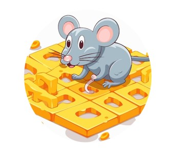
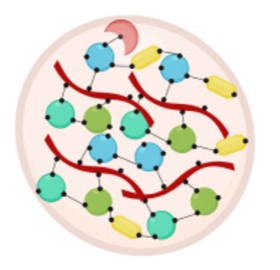
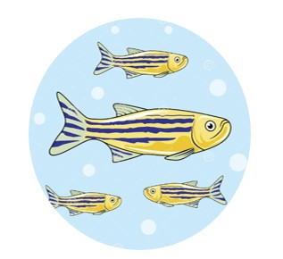
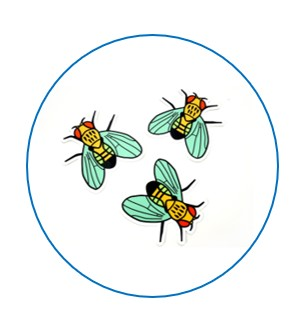
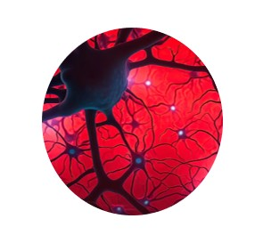

# Lior Lin

### About Me :
I am a M.Sc student in life sciences at the molecular and cellular neuroscience track at the Weizmann institute of science (WIS).

I am doing my research for Thesis at the Hornstein's lab which studies the molecular mechanisms underlying neurodegeneration, focusing on the devastating amyotrophic lateral sclerosis (ALS) disease. 

### Academic Background :
I have completed double major B.Sc studies in Biology and Psychology with emphasis on Neuroscience at the Sagol school of Neuroscience in Tel Aviv University.

# Research experience 
Click on the image icon to be forwarded to the project's slides.
### B.Sc Research Projects :

**Navigation assessment in mice model for the genetic risk factor of Alzheimer's disease.**   
_Laboratory of Prof. Pablo Blinder, Department of Neurobiology, Tel-aviv university._ 

**Investigation of RNA granule dynamics in response to chemical stress exposure in-vitro.**  
_Laboratory of Dr. Ben Maoz, Department of Bio-Medical Engineering, Tel-Aviv university._

### Rotation Projects :

**Effects of zygotic and maternally contributed RE-1 silencing transcription factor on stress coping in Zebrafish larvae**  
_Laboratory of Prof. Gil Levkowitz, Department of Molecular Cell Biology & Molecular Neuroscience, Weizmann Institue of Science._            

**Investigating  mechanisms of DPR12-DIP𝛿 interaction in the Drosophila mushroom body during development**  
_Laboratory of Prof. Oren Schuldiner, Department of Molecular Cell Biology & Molecular Neuroscience, Weizmann Institue of Science._                     

**Characterizing the AI-suggested inter-organellar crosstalk between stress granules and mitochondria in human neurons**  
_Laboratory of Prof. Eran Hornstein, Department of Molecular Genetics, Weizmann Institue of Science._  

# Contact 
lior.lin@weizmann.ac.il | [GitHub Page](https://github.com/LiorLin)
