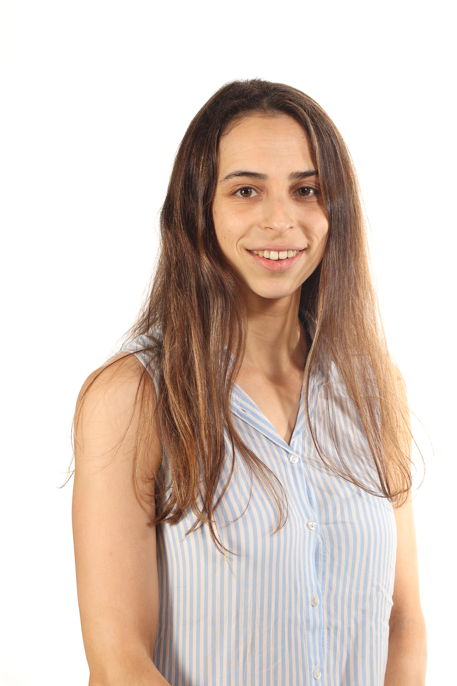

# Lior Lin

### About me :
My name is Lior Lin and I am a M.Sc student in life sciences at the molecular and cellular neuroscience track at the Weizmann institute of science (WIS).

I am doing my research for Thesis at the Hornstein's lab which studies the molecular mechanisms underlying neurodegeneration, focusing on the devastating amyotrophic lateral sclerosis (ALS) disease. 

### Academic Background
I have completed double major B.Sc studies in Biology and Psychology with emphasis on Neuroscience at the Sagol school of Neuroscience in Tel Aviv University. 

### Research experience :
