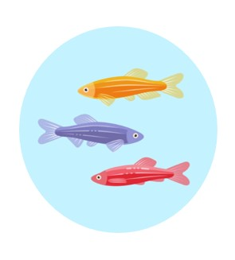

# Lior Lin

### About me :
I am a M.Sc student in life sciences at the molecular and cellular neuroscience track at the Weizmann institute of science (WIS).

I am doing my research for Thesis at the Hornstein's lab which studies the molecular mechanisms underlying neurodegeneration, focusing on the devastating amyotrophic lateral sclerosis (ALS) disease. 

### Academic Background :
I have completed double major B.Sc studies in Biology and Psychology with emphasis on Neuroscience at the Sagol school of Neuroscience in Tel Aviv University.

# Research experience :
### B.Sc Research projects :

**Navigation assessment in mice model for the genetic risk factor of Alzheimer's disease.**   
_Laboratory of Prof. Pablo Blinder, Department of Neurobiology, Tel-aviv university._ 
[Presentation Slides](https://github.com/LiorLin/LiorLin.github.io/blob/main/Assesing%20spatial%20memory%20in%20ApoE4%20mice%20presentation_PDF.pdf)

**Investigation of RNA granule dynamics in response to chemical stress exposure in-vitro.**  
_Laboratory of Dr. Ben Maoz, Department of Bio-Medical Engineering, Tel-Aviv university._ [Project's report](https://github.com/LiorLin/LiorLin.github.io/blob/main/Research%20Project's%20report%20-%20Lior%20Lin.pdf)

### Rotation Projects :

**Effects of zygotic and maternally contributed RE-1 silencing transcription factor on stress coping in Zebrafish larvae**  
_Laboratory of Prof.Gil Levkowitz, Department of Molecular Cell Biology, Weizmann Institue of Science._ [Presentation Slides](https://github.com/LiorLin/LiorLin.github.io/blob/main/Rotations%20seminar%20presentation%20-%20new.pdf)
